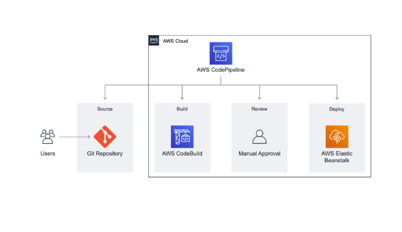
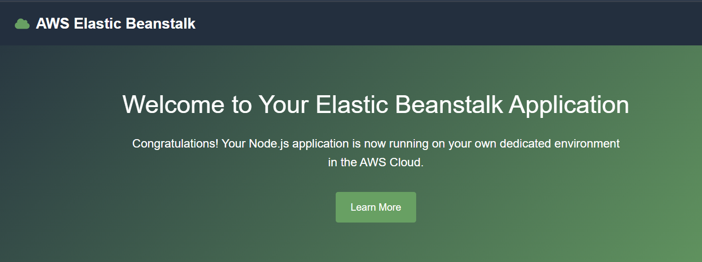
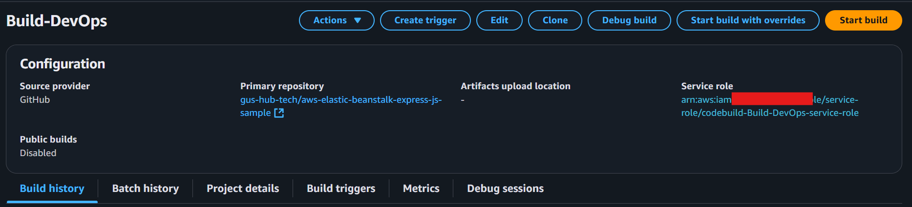
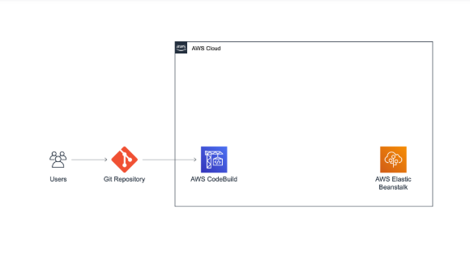
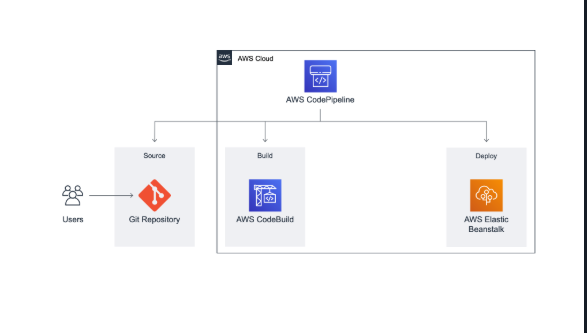
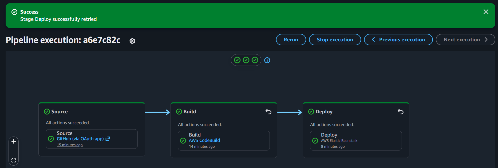
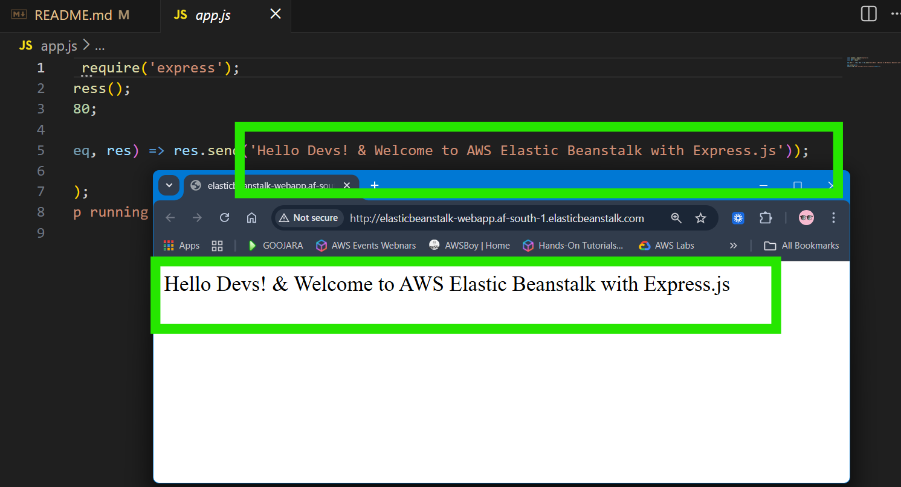

# AWS Continuous Delivery Pipeline

This repository contains resources and documentation for creating a continuous delivery pipeline on AWS, based on the [AWS Hands-on Tutorial](https://docs.aws.amazon.com/hands-on/latest/create-continuous-delivery-pipeline/create-continuous-delivery-pipeline.html).

## Overview

Learn how to build an automated continuous delivery pipeline that deploys your applications to AWS using AWS CodePipeline, AWS CodeBuild, and AWS CodeDeploy. AWS Elastic Beanstalk

## Architecture


The pipeline includes:
- **Source Stage**: GitHub repository
- **Build Stage**: AWS CodeBuild for compilation and testing
- **Deploy Stage**: AWS CodeDeploy for application deployment

## Prerequisites

- AWS Account with appropriate permissions
- AWS CLI configured
- Basic understanding of CI/CD concepts

## Services Used

- **AWS CodePipeline**: Orchestrates the continuous delivery workflow
- **GitHub**: Source control repository
- **AWS CodeBuild**: Builds and tests the application
- **AWS CodeDeploy**: Deploys applications to EC2 instances
- **AWS Elastic Beanstalk**: Hosts the deployed application
- **AWS IAM**: Manages permissions and roles

## Getting Started

1. **Create GitHub Repository**
   ```bash
   gh repo create aws-elastic-beanstalk-express-js-sample --public --clone
   ```
   A repository for your code so it can be easily accessed over the Internet

2. **AWS Elastic Beanstalk**
   - Configure & create elastic beanstalk environment
   - Deploy sample web app to elastic beanstalk
   - Test the sample web app




 A compute service that makes it easy to deploy and manage applications on AWS without having to worry about the infrastructure that runs them.

3. **Create build project**
   ```bash
   Create build with CodeBuild
   Setup Github as source provider for build 
   Run build on AWS CodeBuild
   ```

4. **Code Build**
   - Configure source stage (GitHub)
   - Set up build stage (CodeBuild)
   - Configure deploy stage (CodeDeploy)
   
   
   

## Key Files

- `buildspec.yml`: Build specification for CodeBuild (Tutorial link)
- `appspec.yml`: Deployment specification for CodeDeploy
- Application source code

## Benefits

- Automated testing and deployment
- Reduced manual errors
- Faster time to market
- Consistent deployments
- Easy rollback capabilities

 AWS CodeBuild is a fully managed continuous integration service that compiles source code, runs tests, and produces software packages that are ready to deploy.


## Next Steps

**Build CodePipeline**

- Set up a continuous delivery pipeline on AWS CodePipeline
- Configure a source stage using your GitHub repo
- Configure a build stage using AWS CodeBuild
- Configure a deploy stage using your AWS Elastic Beanstalk application
- Deploy the application hosted on GitHub to Elastic Beanstalk through a pipeline





 The pipeline will detect changes in the code stored in your GitHub repository, build the source code using AWS CodeBuild, and then deploy your application to AWS Elastic Beanstalk.

 **Finalize Pipeline and Test-Manual Approval**

- Add a review stage to your pipeline
- Manually approve a change before it is deployed


 As part of this process, you can add an approval action to a stage at the point where you want the pipeline execution to stop so someone can manually approve or reject the action

## Resources

- [AWS CodePipeline Documentation](https://docs.aws.amazon.com/codepipeline/)
- [AWS CodeBuild Documentation](https://docs.aws.amazon.com/codebuild/)


# AWS Elastic Beanstalk Node.js Sample App

This repository contains a sample Node.js web application built using [Express](https://expressjs.com/), meant to be used as part of the AWS DevOps Learning Path.

## Security

See [CONTRIBUTING](CONTRIBUTING.md#security-issue-notifications) for more information.

## License

This library is licensed under the MIT-0 License. See the LICENSE file.